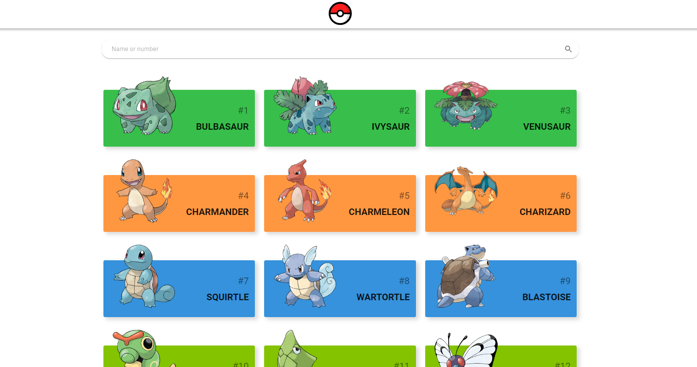

# Pokedex

Es una aplicación web que permite ver el listado de Pokémon de la pokedex nacional. Esta desarrollado con React Js consumiendo la API de Pokemon (Pokeapi). 

Se trabajo en base a componentes de función y el patrón de arquitectura de contexto o parcelas para manejar los estados de manera modular con Context-api.

Entre los patrones de diseño que se pueden observar son: High Order Component, Statefull-Stateless, Style component.

